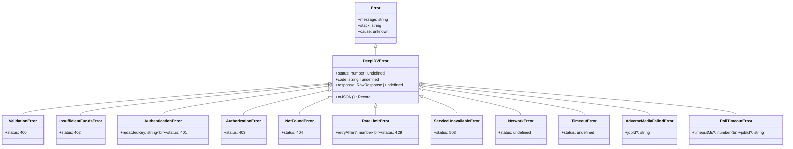
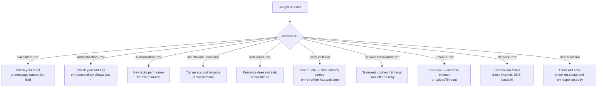

Every error thrown by the SDK is an instance of `DeepIDVError` or one of its subclasses. No untyped exceptions escape the public API, so you can branch on `instanceof` and handle each case precisely.

## Error hierarchy



All error classes are exported from `@deepidv/server`:

```typescript
import {
  DeepIDVError,
  ValidationError,
  AuthenticationError,
  AuthorizationError,
  InsufficientFundsError,
  NotFoundError,
  RateLimitError,
  ServiceUnavailableError,
  NetworkError,
  TimeoutError,
  AdverseMediaFailedError,
  PollTimeoutError,
} from '@deepidv/server';
```

## Error catalog

### `DeepIDVError` (base class)

The base class for all SDK errors. Carries HTTP context when available.

| Field | Type | Description |
| ----- | ---- | ----------- |
| `message` | `string` | Human-readable error description |
| `status` | `number \| undefined` | HTTP status code (undefined for network/timeout errors) |
| `code` | `string \| undefined` | Machine-readable error code from the API |
| `response` | `RawResponse \| undefined` | Raw HTTP response with `status`, `headers`, and `body` |
| `cause` | `unknown` | Original error that triggered this one (`Error.cause` chain) |

Every subclass implements `toJSON()` for structured logging (see below).

### `ValidationError` — HTTP 400

Thrown on HTTP `400`, **or before any network call** when input fails Zod schema validation. The message names the offending field.

```typescript
try {
  // Missing required 'image' field
  await client.document.scan({} as any);
} catch (err) {
  if (err instanceof ValidationError) {
    console.error(err.message); // "Required at 'image'"
  }
}
```

### `AuthenticationError` — HTTP 401

Your API key is invalid, expired, or missing. Carries `redactedKey` (last 4 characters only) — safe to log.

```typescript
catch (err) {
  if (err instanceof AuthenticationError) {
    console.error(`Invalid API key: ${err.redactedKey}`); // "****abcd"
  }
}
```

### `InsufficientFundsError` — HTTP 402

The funds / subscription gate failed — your account doesn't have enough balance for the requested operation.

### `AuthorizationError` — HTTP 403

The API key is valid but lacks permission for the requested resource.

### `NotFoundError` — HTTP 404

The requested resource doesn't exist — e.g. an unknown session ID, or an async job that has been pruned by TTL.

### `RateLimitError` — HTTP 429

Thrown **after all retries are exhausted**. The SDK already retried with exponential backoff, so you've hit a sustained rate limit. `retryAfter` (seconds, from the `Retry-After` header) tells you how long to wait.

```typescript
catch (err) {
  if (err instanceof RateLimitError) {
    console.error(`Rate limited. Retry after ${err.retryAfter}s`);
  }
}
```

### `ServiceUnavailableError` — HTTP 503

A transient upstream timeout. Some screening methods (`pepSanctions`, `titleCheck`) surface this immediately without retrying because the server bounds an un-cancellable upstream — back off and try again later.

### `NetworkError`

A network-level failure: DNS resolution failure, connection refused, socket hangup. `status` is `undefined`.

### `TimeoutError`

A single attempt exceeded the configured `timeout` (API requests) or `uploadTimeout` (uploads). Consider increasing the relevant timeout in [configuration](/integrate/sdks/typescript/server/configuration), or retrying.

### `AdverseMediaFailedError`

An [adverse-media](/integrate/sdks/typescript/server/reference/screening#adversemediainput) async job terminated in the `failed` state. Carries the `jobId` that failed.

### `PollTimeoutError`

`AdverseMediaHandle.wait()` exceeded its `timeoutMs` budget before the job completed. This does **not** mean the job died — it may still complete server-side. Carries `timeoutMs` and `jobId`; resume by polling [`client.asyncJobs.get(jobId)`](/integrate/sdks/typescript/server/reference/async-jobs-events).

## Retry semantics

The SDK retries only **transient** failures — HTTP `429` and `5xx` — up to `maxRetries` times (default `3`) with exponential backoff and jitter. It **never** retries `4xx` client errors, since those are caller bugs a retry won't fix. By the time a `RateLimitError` reaches your `catch` block, the retries are already spent.

See [Configuration → retry & timeout behavior](/integrate/sdks/typescript/server/configuration#retry--timeout-behavior) for tuning, and note that `screening.pepSanctions` / `screening.titleCheck` deliberately opt out of retries.

## Error decision tree



## Structured logging with `toJSON()`

Every `DeepIDVError` implements `toJSON()`, so `JSON.stringify()` produces a clean, log-safe object. The full API key is never serialized:

```typescript
try {
  await client.sessions.retrieve('invalid-id');
} catch (err) {
  if (err instanceof DeepIDVError) {
    console.log(JSON.stringify(err));
    // {
    //   "type": "DeepIDVError",
    //   "message": "Not Found",
    //   "status": 404,
    //   "code": "not_found"
    // }
  }
}
```

This makes it safe to forward errors directly to Sentry, Datadog, or any error-tracking service.

## `Error.cause` chaining

All SDK errors preserve the original cause via the standard `Error.cause` property — useful for debugging the exact failure at each layer:

```typescript
catch (err) {
  if (err instanceof DeepIDVError) {
    console.error('SDK error:', err.message);
    console.error('Caused by:', err.cause); // original fetch error, ZodError, etc.
  }
}
```

## Recommended try/catch pattern

```typescript
import {
  DeepIDV,
  ValidationError,
  AuthenticationError,
  RateLimitError,
  TimeoutError,
  NetworkError,
  DeepIDVError,
} from '@deepidv/server';

try {
  const result = await client.document.scan({ image: buffer });
  console.log(result.fullName);
} catch (err) {
  if (err instanceof ValidationError) {
    console.error('Invalid input:', err.message); // fix your code
  } else if (err instanceof AuthenticationError) {
    console.error('Auth failed:', err.redactedKey); // check config
  } else if (err instanceof RateLimitError) {
    console.error(`Rate limited, retry after ${err.retryAfter}s`); // back off
  } else if (err instanceof TimeoutError) {
    console.error('Timed out'); // retry or raise the timeout
  } else if (err instanceof NetworkError) {
    console.error('Network error:', err.message); // retry later
  } else if (err instanceof DeepIDVError) {
    console.error(`API error ${err.status}: ${err.message}`); // other API error
  } else {
    throw err; // not from the SDK
  }
}
```
