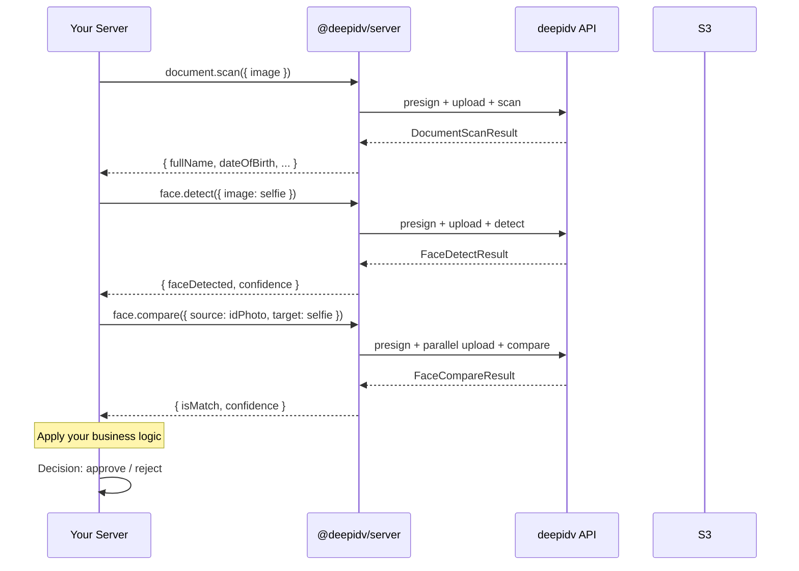

Use the SDK's primitive methods to build your own verification flow — scan documents, detect faces, compare images, and estimate ages with full control over the pipeline. No hosted UI involved.

## When to use this vs. hosted sessions

| Use case | Approach |
| -------- | -------- |
| Standard KYC onboarding | Hosted [sessions](/integrate/sdks/typescript/server/session-verification) — easier, includes UI |
| Custom verification UX | Server-to-server — full control |
| Batch document processing | Server-to-server — no user interaction |
| Backend automation / screening | Server-to-server — programmatic |
| Quick integration, minimal code | Hosted sessions |

## Flow overview



Each primitive accepts a `FileInput` — a `Uint8Array`/`Buffer`, a `ReadableStream`, a base64 / data-URL string, or (on Node, Deno, and Bun) a file path string. The SDK handles presigned upload internally.

## Document scan

Extract structured OCR data from an identity document:

```typescript
import { readFileSync } from 'node:fs';

const result = await client.document.scan({
  image: readFileSync('passport.jpg'),
  documentType: 'passport', // 'passport' | 'drivers_license' | 'national_id' | 'auto'
});
```

`documentType` defaults to `'auto'` — the API detects the type. Specifying it can improve accuracy. The result includes `fullName`, `dateOfBirth`, `documentNumber`, `expirationDate`, `issuingCountry`, an OCR `confidence` (0–1), and more. See the [Document Scan reference](/integrate/sdks/typescript/server/reference/document-face-identity#scaninput) for every field, and the REST [Document Scan](/api-reference/server-to-server/document-scan) endpoint for the full schema.

## Face detection

Detect a face and get confidence, a bounding box, and landmarks:

```typescript
const result = await client.face.detect({
  image: readFileSync('selfie.jpg'),
});

if (result.faceDetected) {
  console.log(`Face confidence: ${result.confidence}`);

  if (result.boundingBox) {
    const { top, left, width, height } = result.boundingBox;
    console.log(`Face at (${left}, ${top}) — ${width}x${height}`);
  }
}
```

REST reference: [Face Detect](/api-reference/server-to-server/face-detect).

## Face comparison

Compare two face images to check if they're the same person. Both images upload in parallel for speed:

```typescript
const result = await client.face.compare({
  source: readFileSync('id-photo.jpg'),
  target: readFileSync('selfie.jpg'),
});

if (result.isMatch) {
  console.log(`Match! Confidence: ${result.confidence}`);
} else {
  console.log(`No match. Confidence: ${result.confidence}, threshold: ${result.threshold}`);
}
```

`confidence` and `threshold` are reported on a 0–100 scale. REST reference: [Face Compare](/api-reference/server-to-server/face-compare).

## Age estimation

Estimate age and gender from a face image:

```typescript
const result = await client.face.estimateAge({
  image: readFileSync('selfie.jpg'),
});

console.log(`Estimated age: ${result.estimatedAge}`);
console.log(`Age range: ${result.ageRange.low}–${result.ageRange.high}`);
console.log(`Gender: ${result.gender} (${result.genderConfidence})`);
```

REST reference: [Face Estimate Age](/api-reference/server-to-server/face-estimate-age).

## Identity verification (shortcut)

`identity.verify()` combines document scan + face detection + face comparison into a single orchestrated call. Both images upload in parallel:

```typescript
const result = await client.identity.verify({
  documentImage: readFileSync('passport.jpg'),
  faceImage: readFileSync('selfie.jpg'),
  documentType: 'passport', // optional, defaults to auto-detect
});

console.log(result.verified); // true / false
console.log(result.overallConfidence); // 96

// Document data
console.log(result.document.fullName);
console.log(result.document.dateOfBirth);

// Face detection
console.log(result.faceDetection.faceDetected);

// Face match
console.log(result.faceMatch.isMatch);
console.log(result.faceMatch.confidence);
```

All three sub-results (`document`, `faceDetection`, `faceMatch`) are always present on a 2xx response, even when `verified` is `false`. REST reference: [Identity Verify](/api-reference/server-to-server/identity-verify).

## Building a custom pipeline

Combine primitives with your own business logic:

```typescript
async function verifyCustomer(idImage: Buffer, selfie: Buffer) {
  // 1. Scan the document
  const doc = await client.document.scan({ image: idImage });

  // 2. Check document quality
  if (doc.confidence < 0.8) {
    return { approved: false, reason: 'Low document quality' };
  }

  // Check expiration
  const expiry = new Date(doc.expirationDate);
  if (expiry < new Date()) {
    return { approved: false, reason: 'Document expired' };
  }

  // 3. Compare faces
  const match = await client.face.compare({
    source: idImage,
    target: selfie,
  });

  if (!match.isMatch) {
    return { approved: false, reason: 'Face mismatch' };
  }

  // 4. Age check (optional)
  const age = await client.face.estimateAge({ image: selfie });
  if (age.estimatedAge < 18) {
    return { approved: false, reason: 'Under 18' };
  }

  return {
    approved: true,
    name: doc.fullName,
    documentNumber: doc.documentNumber,
    faceConfidence: match.confidence,
  };
}
```

Wrap calls in `try/catch` to handle typed failures (bad input, auth, rate limits, timeouts) — see [Error Handling](/integrate/sdks/typescript/server/error-handling).
