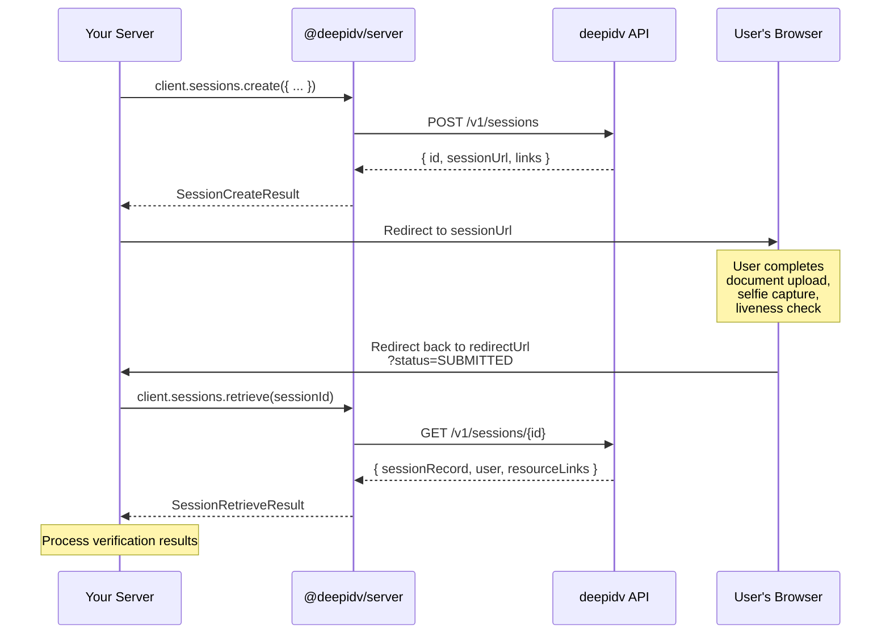

Hosted sessions are the easiest way to verify identities. You create a session, send the user to a hosted verification page, and retrieve the results when they're done — deepidv handles document upload, selfie capture, and liveness for you.

## Flow overview



## Step 1 — Create a session

```typescript
const session = await client.sessions.create({
  // Required fields
  firstName: 'Jane',
  lastName: 'Doe',
  email: 'jane@example.com',
  phone: '+15551234567',

  // Optional: redirect the user back to your app when done
  redirectUrl: 'https://yourapp.com/verification-complete',

  // Optional: your internal reference ID
  externalId: 'user_abc123',

  // Optional: trigger email / SMS invitations
  sendEmailInvite: true,
  sendPhoneInvite: false,

  // Optional: run a specific workflow
  workflowId: 'wf_standard_kyc',
});
```

The result contains the URL to send your user to:

| Field | Type | Description |
| ----- | ---- | ----------- |
| `id` | `string` | Unique session identifier |
| `sessionUrl` | `string` | URL to send the user to for verification |
| `externalId` | `string?` | Your external reference ID (if provided) |
| `links` | `Array<{ url, type }>` | Associated resource links |

<Note>
  This maps to the REST [Create Session](/api-reference/sessions/create-session) endpoint — see it for the full request/response schema and the `redirect_url` callback parameters.
</Note>

## Step 2 — Send the user to verify

Redirect the user to `session.sessionUrl`. On the hosted page they:

1. Upload their identity document (passport, driver's license, national ID).
2. Take a selfie for face matching.
3. Complete liveness detection.

## Step 3 — Handle the callback

When the user finishes (or abandons), they're redirected to your `redirectUrl` with query parameters appended:

```
https://yourapp.com/verification-complete?status=SUBMITTED&sessionId=abc123
```

See [Create Session → Redirect URL](/api-reference/sessions/create-session#redirect-url) for the full list of `status` and `reason` values.

## Step 4 — Retrieve results

```typescript
const result = await client.sessions.retrieve(session.id);

const record = result.sessionRecord;
console.log(record.status); // "SUBMITTED"
console.log(record.sessionProgress); // "COMPLETED"
```

### Navigating analysis data

The `analysisData` field carries all verification results:

```typescript
const analysis = record.analysisData;

if (analysis) {
  // Face match between ID and selfie
  console.log(analysis.idMatchesSelfie); // true / false
  console.log(analysis.facelivenessScore); // 0.99

  // Document OCR data
  const idData = analysis.idAnalysisData;
  if (idData) {
    for (const field of idData.idExtractedText) {
      console.log(`${field.type}: ${field.value} (${field.confidence})`);
    }

    // Compliance checks
    console.log(idData.expiryDatePass); // true = not expired
    console.log(idData.validStatePass); // true = valid jurisdiction
    console.log(idData.ageRestrictionPass); // true = meets age requirement
  }

  // Face comparison details
  const compare = analysis.compareFacesData;
  if (compare) {
    console.log(compare.faceMatchConfidence); // 0.94
  }
}
```

### Resource links

Presigned URLs for accessing uploaded documents and images:

```typescript
if (result.resourceLinks) {
  for (const [name, url] of Object.entries(result.resourceLinks)) {
    console.log(`${name}: ${url}`);
    // "id_front: https://s3.amazonaws.com/..."
    // "selfie:   https://s3.amazonaws.com/..."
  }
}
```

## Step 5 — Update session status

After reviewing the results, set the final status:

```typescript
// Approve the verification
await client.sessions.updateStatus(session.id, 'VERIFIED');

// Or reject it
await client.sessions.updateStatus(session.id, 'REJECTED');

// Or void it (e.g. a duplicate submission)
await client.sessions.updateStatus(session.id, 'VOIDED');
```

Only `VERIFIED`, `REJECTED`, and `VOIDED` are valid targets. You cannot set `PENDING` or `SUBMITTED` — those are managed by the API based on user activity. See the REST [Update Session Status](/api-reference/sessions/update-session-status) endpoint.

## Listing sessions

```typescript
// List all sessions
const page = await client.sessions.list();
console.log(`Found ${page.data.length} sessions`);

// Filter by status
const verified = await client.sessions.list({
  status: 'VERIFIED',
  limit: 10,
  offset: 0,
});

for (const session of verified.data) {
  console.log(`${session.id}: ${session.status} (${session.createdAt})`);
}
```

### Pagination

```typescript
let offset = 0;
const limit = 25;

while (true) {
  const page = await client.sessions.list({ limit, offset });

  for (const session of page.data) {
    processSession(session);
  }

  if (!page.hasMore || page.data.length < limit) break;
  offset += limit;
}
```

The paginated response wraps `data` with `total`, `hasMore`, `limit`, and `offset`. See the REST [List Sessions](/api-reference/sessions/list-sessions) endpoint and the [Sessions reference](/integrate/sdks/typescript/server/reference/sessions) for the full types.

## Session statuses

| Status | Meaning | Set by |
| ------ | ------- | ------ |
| `PENDING` | Session created, user hasn't started | API |
| `SUBMITTED` | User completed the verification flow | API |
| `VERIFIED` | Approved by your team | You (via `updateStatus`) |
| `REJECTED` | Rejected by your team | You (via `updateStatus`) |
| `VOIDED` | Cancelled / invalidated | You (via `updateStatus`) |
