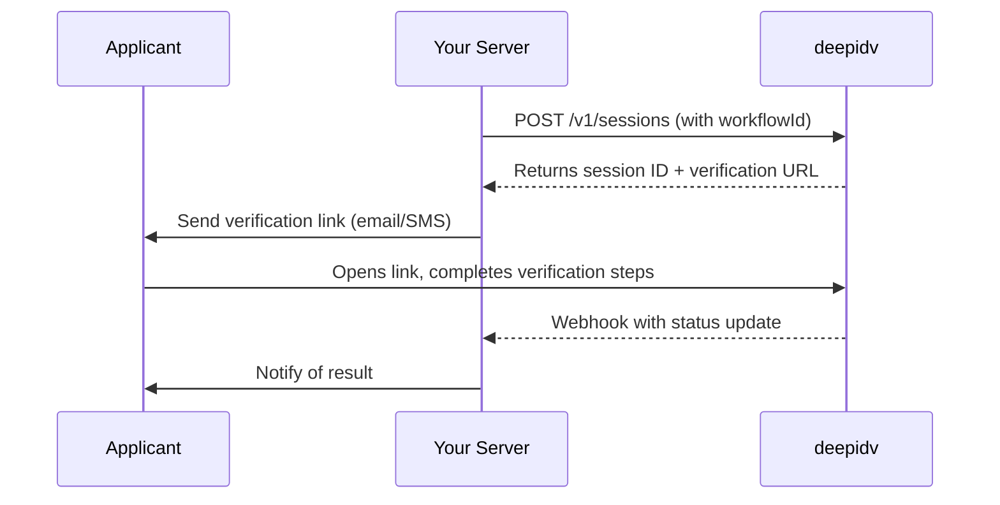

> Design multi-step verification flows by combining the exact services you need — then trigger them with a single API call or verification link.

export const VideoEmbed = ({ src, title = "Video" }) => (
  <div className="deepidv-video-embed">
    <iframe
      src={src}
      title={title}
      allow="accelerometer; autoplay; clipboard-write; encrypted-media; gyroscope; picture-in-picture"
      allowFullScreen
    />
  </div>
);

export const SectionHeader = ({
  label,
  title,
  description,
  align = "left",
}) => (
  <div
    className="deepidv-section-header"
    style={{
      textAlign: align,
      alignItems: align === "center" ? "center" : "flex-start",
    }}
  >
    {label && <p className="deepidv-section-label">{label}</p>}
    <h2 className="deepidv-section-title">{title}</h2>
    {description && <p className="deepidv-section-desc">{description}</p>}
  </div>
);

export const FeatureGrid = ({ cols = 3, children }) => (
  <div
    className="deepidv-feature-grid"
    style={{
      "--grid-cols": cols,
    }}
  >
    {children}
  </div>
);

export const FeatureCard = ({ icon, title, description }) => (
  <div className="deepidv-feature-card">
    {icon && (
      <div className="deepidv-feature-card-icon">
        <Icon icon={icon} size={20} />
      </div>
    )}
    <div className="deepidv-feature-card-content">
      <h3 className="deepidv-feature-card-title">{title}</h3>
      {description && (
        <p className="deepidv-feature-card-desc">{description}</p>
      )}
    </div>
  </div>
);

Workflows are the core of deepidv. Instead of configuring individual services every time, you build a reusable flow once — pick your services and reference that workflow by ID whenever you create a session. deepidv intelligently determines the optimal step order to minimize friction for the applicant.

<VideoEmbed
  src="https://www.youtube.com/embed/mNr4SFCg_uM?rel=0&playsinline=1"
  title="deepidv Workflow Builder"
/>

Head to [**app.deepidv.com/dashboard/workflow**](https://app.deepidv.com/dashboard/workflow) to create workflows and browse templates.

---

## How Workflows Work

A workflow defines:

- **Which services to run** — any combination of the services available on the platform
- **The total session cost** — the sum of all enabled services

When you create a session with a `workflowId`, deepidv automatically runs every check in that workflow. The platform intelligently orders the steps to reduce friction and maximize completion rates — results come back as a single session.

---

## Available Workflow Services

Drag and drop any of these into your workflow:

<FeatureGrid cols={3}>
  <FeatureCard icon="id-card" title="ID Verification" description="Scan and validate government-issued identity documents." />

  <FeatureCard icon="video" title="Face Liveness" description="Confirm the applicant is a real, live person." />

  <FeatureCard icon="cake-candles" title="Age Estimation" description="Predict the applicant's age from a selfie." />

  <FeatureCard icon="shield-check" title="PEP & Sanctions" description="Screen against global sanctions and PEP lists." />

  <FeatureCard icon="newspaper" title="Adverse Media" description="Scan for negative press and legal mentions." />

  <FeatureCard icon="phone" title="Phone Verification" description="Live call with a spoken voice prompt to verify identity." />

  <FeatureCard icon="location-dot" title="Address Verification" description="AI-driven questions to confirm the applicant's location." />

  <FeatureCard icon="building-columns" title="Bank Statement Sync" description="Pull bank statements via open banking." />

  <FeatureCard icon="chart-mixed" title="AI Bank Analysis" description="AI breakdown of income, spending, and affordability." />

  <FeatureCard icon="magnifying-glass" title="Title Search" description="Look up property title records and lien data." />

  <FeatureCard icon="file-shield" title="Document Upload" description="Collect documents with AI fraud detection." />

  <FeatureCard icon="camera" title="Custom Prompt Picture" description="Request a specific photo based on your prompt." />

  <FeatureCard icon="clipboard-list" title="Custom Forms" description="Add custom questions, fields, and file uploads." />

</FeatureGrid>

<Tip>
  The total cost of a workflow session is the sum of each enabled service. Only add what you actually need — see [Pricing](/pricing) for per-service rates.
</Tip>

---

## Creating a Workflow

### From the Admin Console

1. Go to [**Workflows**](https://app.deepidv.com/dashboard/workflow) in the sidebar
2. Click **Create Workflow**
3. Pick a name and drag and drop the services you want to design your workflow
4. Save — deepidv handles the step ordering automatically

You can also start from a **template** — pre-configured workflows for common use cases that you can customize to fit your needs.

### Via the API

Manage workflows programmatically through the [Workflows API](/api-reference/workflows/list-workflows).

---

## Workflow Templates

Templates are pre-built starting points designed for the most common verification scenarios. Pick one, tweak the services, and you're live.

### KYC Onboarding

The go-to template for full identity verification during user signup.

- **Starts with:** ID Verification
- **Commonly added:**
  - `[+]` **Face Liveness** — confirm the applicant is physically present
  - `[+]` **PEP & Sanctions** — screen against global watchlists
  - `[+]` **Adverse Media** — surface negative press or legal mentions
  - `[+]` **Phone Verification** — verify phone ownership via live call
  - `[+]` **Custom Forms** — collect additional data points specific to your onboarding

---

### Lending & Financial Services

Built for lenders, brokers, and financial service providers who need both identity and financial data.

- **Starts with:** ID Verification
- **Commonly added:**
  - `[+]` **Face Liveness** — stop spoofed applications
  - `[+]` **Bank Statement Sync** — pull transaction data directly from the applicant's bank
  - `[+]` **AI Bank Analysis** — automated income, spending, and affordability breakdown
  - `[+]` **PEP & Sanctions** — compliance screening
  - `[+]` **Title Search** — property ownership and lien lookups
  - `[+]` **Document Upload** — collect pay stubs, tax returns, or other supporting docs with fraud detection

---

### Age-Gated Access

A lightweight flow for services that need to confirm the applicant meets a minimum age.

- **Starts with:** Age Estimation via selfie
- **Fallback logic:** If the estimate is borderline or below your threshold, the workflow can trigger a full **ID Verification** step to confirm date of birth from the document
- **Commonly added:**
  - `[+]` **Face Liveness** — prevent photo or video spoofing

---

### Property & Real Estate

Designed for real estate transactions, property management, and title companies.

- **Starts with:** ID Verification
- **Commonly added:**
  - `[+]` **Title Search** — pull ownership history, liens, and encumbrances
  - `[+]` **Address Verification** — AI-powered location confirmation
  - `[+]` **Document Upload** — collect lease agreements, contracts, or proof of ownership with fraud detection
  - `[+]` **Custom Forms** — capture property details or tenant information

---

### Custom Workflow

Start from scratch and build exactly what your use case requires. Drag and drop any combination of services to design your workflow and save.

<Note>
  Every template can be fully customized after creation. Add or remove services at any time from the Admin Console.
</Note>

---

## Using a Workflow

Once you've built a workflow, reference it by `workflowId` when creating sessions:

```bash
curl -X POST https://api.deepidv.com/v1/sessions \
  -H "Content-Type: application/json" \
  -H "x-api-key: YOUR_API_KEY" \
  -d '{
    "firstName": "Jane",
    "lastName": "Smith",
    "email": "jane.smith@example.com",
    "phone": "+14165557890",
    "workflowId": "wf_abc123"
  }'
```

<Note>
  Find your `workflowId` in the [Admin Console](https://app.deepidv.com/dashboard/workflow) under **Workflows**.
</Note>

---

## Integration Flow

Your backend creates a session with deepidv, receives a verification URL, and redirects the applicant. deepidv handles the entire user-facing experience and notifies your server when results are ready.



---

## Common Use Cases

| Use Case | Recommended Template | Key Services |
| --- | --- | --- |
| Standard user onboarding | KYC Onboarding | ID Verification, Face Liveness, PEP & Sanctions |
| Mortgage or loan application | Lending & Financial | ID, Bank Sync, AI Analysis, Title Search, Doc Upload |
| Age-restricted product/content | Age-Gated Access | Age Estimation, Face Liveness, ID fallback |
| Tenant screening | Property & Real Estate | ID, Address Verification, Custom Forms, Doc Upload |
| Compliance-heavy onboarding | KYC Onboarding | ID, Face Liveness, PEP, Adverse Media, Phone Verification |
| Quick document collection | Custom | Document Upload, Custom Forms |

---

## Managing Workflows

### List all workflows

```bash
curl -X GET https://api.deepidv.com/v1/workflows \
  -H "x-api-key: YOUR_API_KEY"
```

### Retrieve a specific workflow

```bash
curl -X GET https://api.deepidv.com/v1/workflows/wf_abc123 \
  -H "x-api-key: YOUR_API_KEY"
```

### View sessions for a workflow

```bash
curl -X GET "https://api.deepidv.com/v1/sessions?workflow_id=wf_abc123" \
  -H "x-api-key: YOUR_API_KEY"
```

See the full [Workflows API Reference](/api-reference/workflows/list-workflows) and [Sessions API Reference](/api-reference/sessions/list-sessions) for complete endpoint details.

---

## Getting Started

<CardGroup cols={2}>
  <Card title="Build Your First Workflow" icon="diagram-project" href="https://app.deepidv.com/dashboard/workflow">
    Open the workflow builder and start configuring.
  </Card>

  <Card title="Quick Start Guide" icon="rocket" href="/quickstart">
    End-to-end walkthrough from account setup to first session.
  </Card>
</CardGroup>
